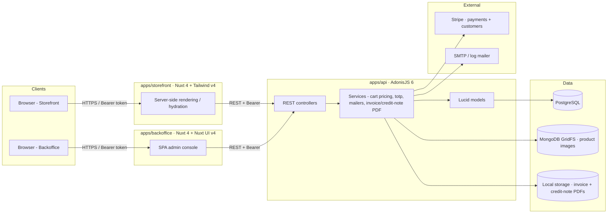
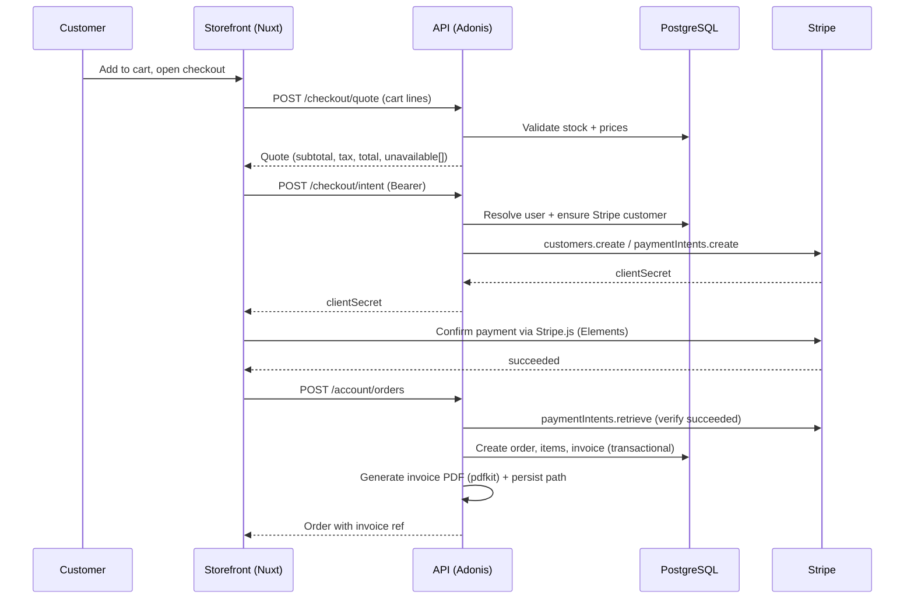
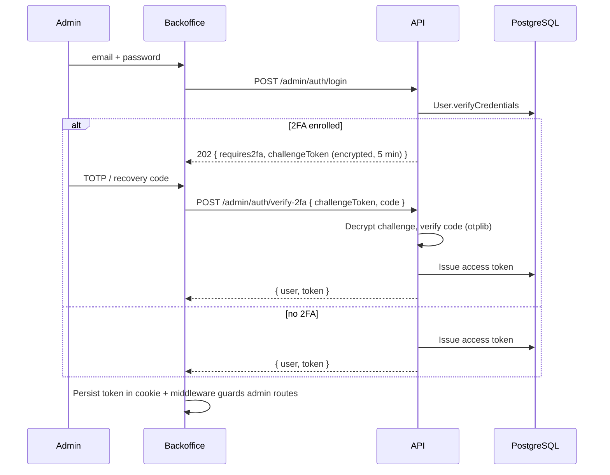

# Althea Systems — Architecture (DCT)

This document captures the technical architecture of the Althea Systems platform: the
three Nuxt/Adonis applications that make up the system, how they communicate, where data
lives, and the rationale behind each technology choice.

## 1. High-level architecture



## 2. Data flow — checkout



## 3. Data flow — admin login (with 2FA)



## 4. Storage map

| Concern              | Store                  | Why                                                   |
|----------------------|------------------------|-------------------------------------------------------|
| Relational data      | PostgreSQL             | Transactions for orders, FKs, Lucid integration       |
| Product images       | MongoDB GridFS         | Binary blobs streamed directly to clients             |
| Invoice / credit PDF | Local filesystem       | Generated lazily by pdfkit, served by API only        |
| Sessions             | DB access tokens       | Bearer tokens with TTL, revocable from /logout        |
| Locale preference    | `althea_locale` cookie | Read by `@nuxtjs/i18n`, drives RTL toggle             |

## 5. Tech stack rationale

### Storefront — Nuxt 4
- SSR-first improves SEO for category and product pages.
- Composition API + auto-imports keeps pages and composables small (`useApi`,
  `useAuth`, `useCart`, `useStripe`) without manual boilerplate.
- Tailwind v4 with `@theme` tokens ships fast and consistent design without a
  component-library lock-in.
- `@nuxtjs/i18n` provides the locale switching, browser detection and RTL/LTR
  toggling (used for Arabic).
- `@stripe/stripe-js` with Elements is the only canonical way to charge cards
  while keeping PCI-DSS scope minimal.

### Backoffice — Nuxt 4 + Nuxt UI v4
- Same runtime as the storefront so the team only learns one frontend stack.
- Nuxt UI v4 ships dashboard primitives (`UDashboardGroup`, `UDashboardSidebar`,
  `UTable`, `UModal`, `USlideover`) which would otherwise take weeks to build.
- Chart.js + vue-chartjs for sales analytics — small (~70 KB gzipped) and
  trivially integrates with our SSR setup via `<ClientOnly>`.
- TipTap for the homepage rich-text editor — chosen over a custom contentEditable
  for proper schema, marks (bold/italic/link/color), and SSR-safe mounting.

### API — AdonisJS 6
- TypeScript-first, opinionated structure (controllers, validators, services,
  middleware) reduces bikeshedding.
- Lucid ORM keeps queries explicit, supports transactions and naturalSort
  migrations. Snake_case column conventions match Postgres idioms.
- Vine validators run at the controller boundary — schemas live next to routes
  rather than scattered through service code.
- `@adonisjs/auth` + `DbAccessTokensProvider` gives revocable bearer tokens out
  of the box; we build admin 2FA on top via otplib + an encrypted challenge.
- `@adonisjs/mail` abstracts SMTP / log drivers so dev runs without a real MTA.

### Storage choices
- **PostgreSQL** for relational guarantees on orders/invoices.
- **MongoDB GridFS** because product images can be large and benefit from
  chunked streaming. Keeping binaries out of Postgres simplifies backups.
- **Local filesystem** for generated PDFs is acceptable for now; production
  should switch to S3-compatible object storage and update
  `invoice_generator.ts` / `credit_note_generator.ts` accordingly.

## 6. Repository layout

```
althea-systems/
├── apps/
│   ├── api/              # AdonisJS 6 — REST API
│   ├── backoffice/       # Nuxt 4 + Nuxt UI — admin console
│   └── storefront/       # Nuxt 4 — public web app
├── docs/                 # Architecture, deployment, API spec, security
├── packages/             # (reserved) shared libs
├── docker-compose.yml    # Postgres + Mongo for local dev
└── pnpm-workspace.yaml
```

## 7. Cross-app contracts

- All apps consume the API over HTTP and authenticate with a Bearer token issued
  by `/auth/login` (storefront) or `/admin/auth/login` (backoffice).
- The OpenAPI source of truth is `docs/openapi.yaml`, served by the API at
  `/docs` (Swagger UI) and `/openapi.yaml` (raw).
- CORS allows any origin with credentials in dev; production must pin
  `apps/api/config/cors.ts` to the storefront and backoffice origins.
